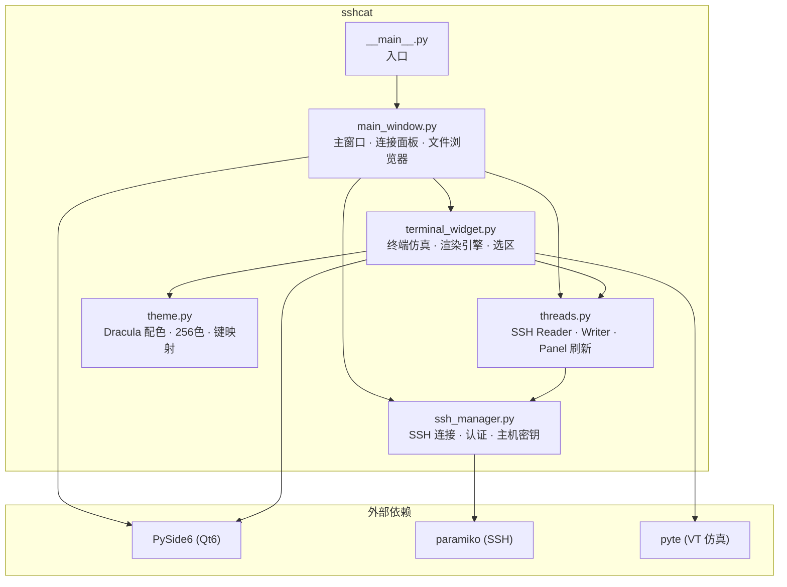

# SSHcat 🐱

**基于 PySide6 的现代 SSH 终端客户端** — Dracula 暗色主题 · 高性能终端仿真 · 服务器监控面板


## 功能特性

- **完整终端仿真** — 基于 pyte 的 VT100/xterm 兼容终端，支持 256 色、粗体/斜体/下划线
- **高性能渲染** — 脏区渲染 + 离屏双缓冲 + QColor 缓存 + 字体变体预构建，60fps 流畅刷新
- **5000 行回滚缓冲** — 鼠标滚轮 + 滚动条浏览历史输出
- **鼠标选区** — 拖选复制、右键粘贴、Ctrl+C 智能切换（有选区时复制，否则中断）
- **服务器监控面板** — 实时 CPU / 内存 / 磁盘占用率（进度条），运行时间显示
- **目录浏览器** — 双击进入目录、右键删除、返回上级
- **SSH 密钥认证** — 支持 RSA / Ed25519 / ECDSA 密钥文件，密码认证可选
- **主机密钥验证** — 首次连接自动保存指纹，后续验证防止中间人攻击
- **连接历史** — 自动保存最近 20 条连接记录，一键快速重连
- **断线自动重连** — 连接意外断开后自动尝试恢复
- **IME 中文输入** — 完整输入法支持
- **Dracula 主题** — 全局暗色调，Windows 标题栏颜色适配

## 架构



### 模块说明

| 模块 | 行数 | 职责 |
|------|------|------|
| `theme.py` | ~140 | Dracula 配色、ANSI 16色/256色映射、键盘→ANSI 转义序列映射表 |
| `ssh_manager.py` | ~170 | SSH 连接生命周期、密码/密钥双认证、主机密钥验证策略 |
| `threads.py` | ~230 | SSH 数据读取（渐进式 sleep）、异步写入队列、系统信息采集 |
| `terminal_widget.py` | ~460 | pyte 终端仿真、脏区渲染、离屏缓冲、回滚、鼠标选区、IME |
| `main_window.py` | ~580 | 连接面板 UI、目录浏览器、系统监控、历史记录、断线重连 |

### 渐进式 Sleep 策略

SSH 读取线程使用三级渐进 sleep 平衡延迟与 CPU 消耗：

```
idle_count < 5   → sleep 1ms   (打字时几乎无感)
idle_count < 20  → sleep 2ms   (短暂空闲)
idle_count ≥ 20  → sleep 5ms   (长期空闲，省 CPU)
```

收到数据后 `idle_count` 立即归零，恢复最低延迟。

## 快速开始

### 环境要求

- Python 3.10+
- Windows 10/11（使用 DWM API 适配暗色标题栏）

### 安装

```bash
git clone https://github.com/HopkeyEZ/SSHcat.git
cd SSHcat
pip install -r requirements.txt
```

### 运行

```bash
python -m sshcat
```

### 打包为可执行文件

```bash
pip install pyinstaller
pyinstaller SSHcat.spec
# 产物在 dist/SSHcat/SSHcat.exe
```

## 测试

```bash
pip install pytest
python -m pytest tests/ -v
```

当前覆盖：
- ✅ 颜色解析（16色 / 256色 / hex RGB / 边界值）
- ✅ 键盘映射（方向键 / 功能键 / Ctrl 组合键）
- ✅ 渐进式 sleep 阈值与时长
- ✅ SSH 管理器生命周期
- ✅ 主机密钥策略
- ✅ 连接历史持久化

## 技术栈

| 组件 | 技术 |
|------|------|
| GUI 框架 | PySide6 (Qt 6) |
| SSH 协议 | paramiko |
| 终端仿真 | pyte (VT100/xterm) |
| 渲染 | QImage 离屏缓冲 + 脏区优化 |
| 主题 | Dracula |
| 打包 | PyInstaller |
| 测试 | pytest |
| CI | GitHub Actions |

## 项目结构

```
SSHcat/
├── sshcat/                  # 核心包
│   ├── __init__.py
│   ├── __main__.py          # 入口
│   ├── theme.py             # 配色 + 键映射
│   ├── ssh_manager.py       # SSH 连接管理
│   ├── threads.py           # 后台线程
│   ├── terminal_widget.py   # 终端控件
│   └── main_window.py       # 主窗口
├── tests/                   # 单元测试
│   ├── test_theme.py
│   ├── test_threads.py
│   ├── test_ssh_manager.py
│   └── test_history.py
├── .github/workflows/       # CI
│   └── ci.yml
├── requirements.txt
├── SSHcat.spec              # PyInstaller 配置
├── icon.ico
└── README.md
```

## License

MIT
